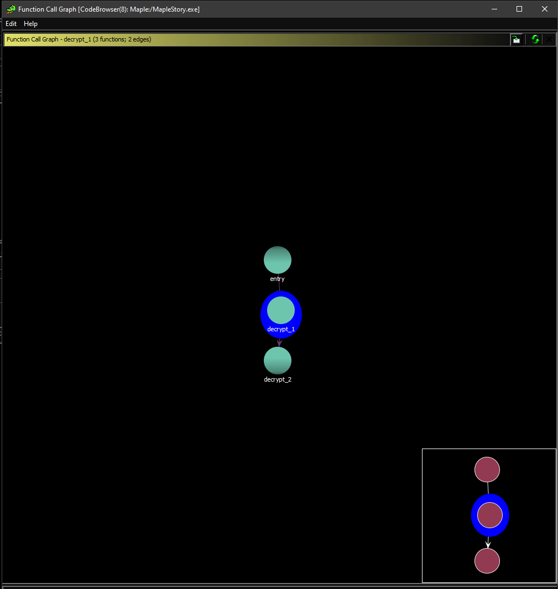
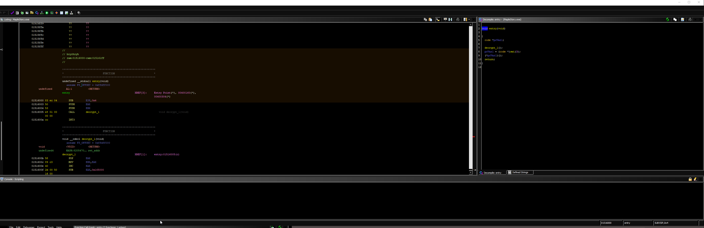
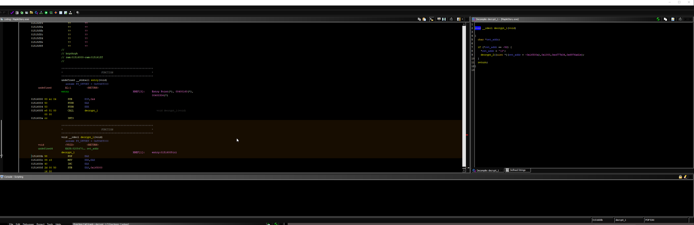
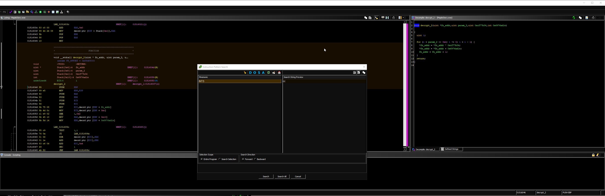

<h1>A Not So Useful ManoMS Decryption Function</h1>

\* You do not need to know any of the technical terms that I use. I just thought it may be helpful for more technical people. Feel free to correct me if you notice any mistakes\
  ** I am missing some details, like what encryption function they used or how they determined what will be decrypted.\
  *** I made changes to the function calls on Ghidra, so if you do notice that it's different than your exe when you drop it into Ghidra, just know I made certain modifications based on my choice (eg: Change to some functions to void since the returned values are not used)

I don't really know how useful this is for you all, but I will play with this client more on my free time since I am getting some experience looking at encrypted files. It's nice of the ManoMS creators to make it easier to find their decryption function on Ghidra. In the screenshots provided, I will go over what I did and what you can use this for.

The first image is to show the calling tree of ManoMS on the "main" decryption function. We will refer to this function as "decrypt_1" for simplicities sake. In the same image, we can also see that decrypt_2 (callee) that is being called by decrypt_1 (caller).

The second image is the "entry" function calling "decrypt_1". I do not think there is much to care about for this part, besides it maybe calling "decrypt_1" once. Just know that this is run before everything else.

\* Char is 8 bits; This is the same size as a u8 (8-bit unsigned int)\
  ** I think C++ uses uint8_t to represent u8 (Rust-lang)

The third image is the "decrypt_1" function. My understanding of this function is that it looks for a function with -52 (or 0xcc), then performs the decryption algorithm (I don't know if it's just calling this decryption all the way until the end or maybe it is a call_back function; Feel free to correct this part). The reason we know it's bytes is because of Opcodes in ASM. Since we are dealing with a decryption function, we should assume Opcodes are the target.

What it does: It takes the first Opcode that the "ret_addr" points to and sets it to 0x00 (NULL). Then, it takes in some parameters (Which I will talk about in decrypt_2: Just know that there are constant values pushed into the parameters).
Just remember the parameters as such:

1. ret_addr + -0x16500a (fn_addr)
2. 0x1000 (4092 == 2^12)
3. 0xcf77b34
4. 0x6976ad1e

The fourth image is the "decrypt_2" function. The way this function will work is by doing:

1. XOR: {derefenced: fn_addr [OPCODE]} = {derefenced: fn_addr [OPCODE]} ^ 0xcf77b34
2. ADD: {derefenced: fn_addr [OPCODE]} = {derefenced: fn_addr [OPCODE]} + 0x6976ad1e
3. ADD: {fn_addr} = {fn_addr} + 1

That's the algorithm. I didn't write a function to decrypt it, but I will see what I do with it.\
\* Notice how in param_2 (0x1000), the value is 2^12 or 4092. Then, in the for loop, it performs a logical shift to the right by 2. If you know some CS basics, a logical right/left shift is a divide/multiply by 2 for each shift. That means 2^{amount of shifts}. In this case, it is (2^12 / 2^2) = 2^10 calls (since we are decrementing 2^10 by 1).

Here are some references to read if you want to learn/understand more about what I reversed. My goal is to probably take the decryption function and call it to perform the decrypted exe. If I am successful, I will upload it to MPGH.

References:
- [Youtube: Reverse engineering with #Ghidra: Breaking an embedded firmware encryption scheme](https://www.youtube.com/watch?v=4urMITJKQQs)
- [Can anyone explain why '>>2' shift means 'divided by 4' in C codes?](https://stackoverflow.com/questions/13577174/can-anyone-explain-why-2-shift-means-divided-by-4-in-c-codes)
- [What Is a Crypto Virus and How Does It Work?](https://heimdalsecurity.com/blog/crypto-virus/)